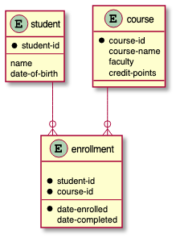
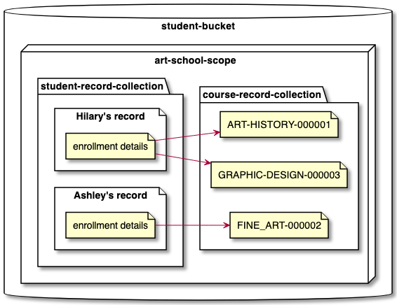
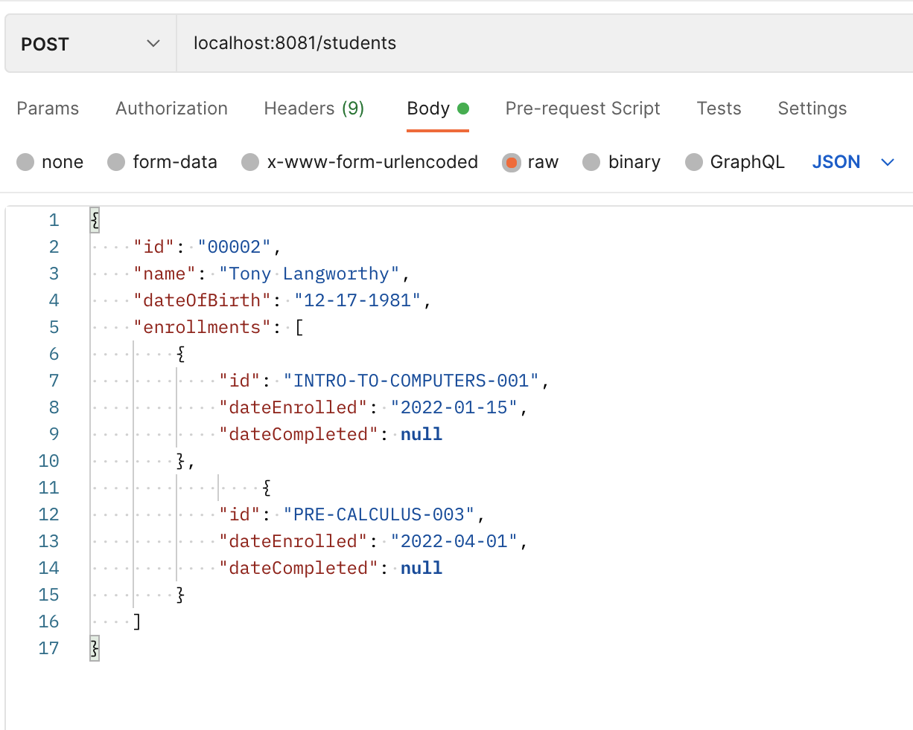
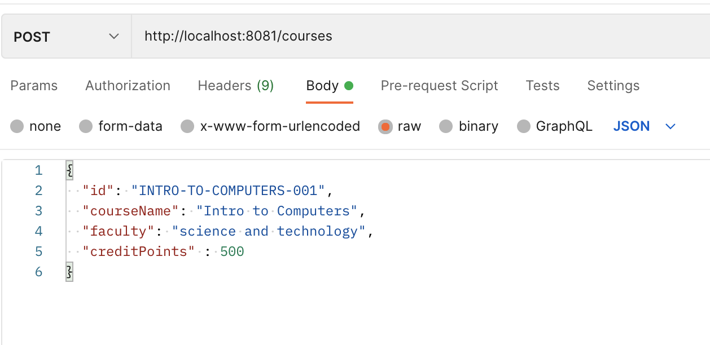

# Spring Boot + Couchbase Student Application

---

This is a simple Java/Spring Boot application that demonstrates using Couchbase 
as a database in a Spring Boot application using **Spring Data Couchbase**. 

**NOTE:** *This is a POC, and not meant to be production 
quality.*

##The "real life" example:

Some place, maybe a community college, or maybe a small yoga school, offers courses.  Of course students would enroll.  

Here is a example of how relationships might look in a relational database.

  

Here is how they look with the Couchbase NoSQL database.

  

### REST API Endpoints
* GET `/students` - Returns all students
* POST `/students` - Stores a student
* GET `/courses` - Returns all courses
* POST `/courses` - Stores a course

## Running the application
After cloning the project, run `./mvnw clean install` to build it. The application will 
run on port `8081`.

### Adding a student
Make a `POST` request to `http://localhost:8081/students`.
The body should contain a JSON document as shown in the screenshot.

### Adding a course
Make a `POST` request to `http://localhost:8081/courses`.
Again, the body should contain a JSON document as shown in the screenshot.

## References

[Baeldung Spring Data Couchbase Tutorial](https://www.baeldung.com/spring-data-couchbase)

[Couchbase Tutorial (Official Documentation)](https://docs.couchbase.com/server/current/tutorials/couchbase-tutorial-student-records.html)

[Spring Boot Couchbase Project (Official Documentation)](https://docs.spring.io/spring-data/couchbase/docs/current/reference/html/)

